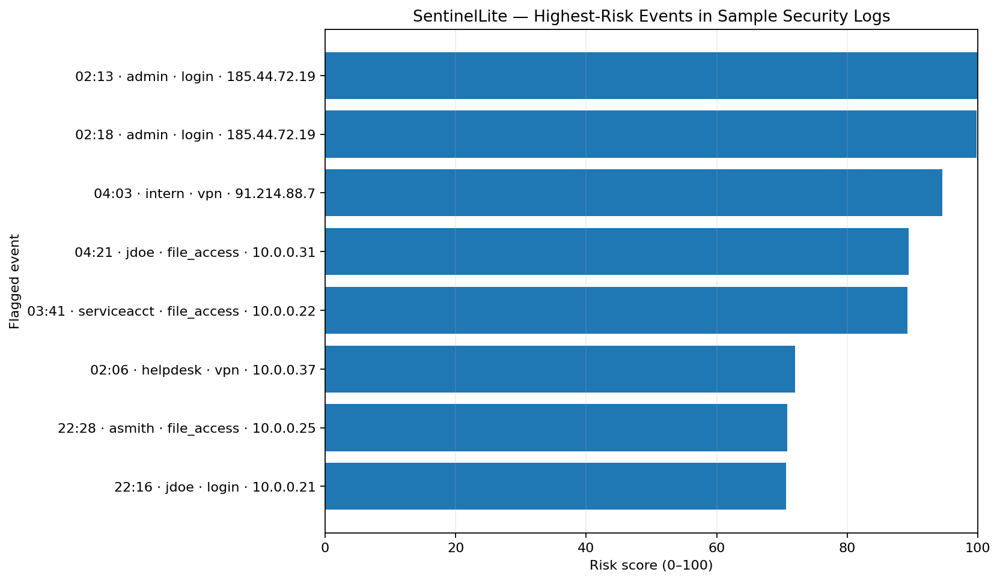

# SentinelLite

A lightweight Python security-log anomaly detector built as a portfolio project.

SentinelLite combines **feature engineering**, **Isolation Forest anomaly detection**, and
simple explainable security rules to identify suspicious events in authentication and
activity logs.

## Live Demo

🚀 **[Launch the SentinelLite Security Dashboard](https://sentinellite-security.streamlit.app/)**

Try SentinelLite in your browser: analyze the included sample security logs, adjust anomaly-detection sensitivity, inspect risk-ranked events, or upload a compatible CSV file.

## Why I built it

Security teams often have more log data than they can manually review. This project shows
how machine learning can help prioritize unusual events for **human review** without
pretending that an anomaly automatically means malicious activity.

## What it demonstrates

- Python
- pandas
- scikit-learn
- anomaly detection
- feature engineering
- basic security analytics
- explainable rule-based scoring
- command-line tooling
- unit testing
- Streamlit dashboarding
- data visualization

## Detection logic

The model looks at:

- failed login attempts
- outbound byte volume
- time of day
- off-hours activity
- login failures
- whether the source IP appears external

It then combines:

1. an **Isolation Forest** statistical anomaly score, and
2. transparent rules for events such as repeated failures, unusually large data transfer,
   and external off-hours activity.

The result is a 0-100 `risk_score` used to prioritize review.

> **Important:** SentinelLite flags unusual activity. It does not determine that an event is
> malicious or that a person committed wrongdoing.

## Quick start

```bash
git clone https://github.com/hallleedustin-alt/SentinelLite.git
cd SentinelLite

python -m venv .venv

# Windows
.venv\Scripts\activate

pip install -r requirements.txt

python sentinellite.py sample_logs.csv
```

## Example output

```text
SentinelLite analysis complete
----------------------------------
Events analyzed : 355
Events flagged  : 15
Flag rate       : 4.23%
Highest risk    : 100.0

Saved: anomalies.csv
Saved: summary.json
```

The output CSV ranks suspicious events so an analyst can investigate the highest-risk
activity first.


## Visual results

The chart below is generated from SentinelLite's included sample security-log dataset.



## Interactive dashboard

SentinelLite also includes a Streamlit dashboard for interactive analyst review.

Run it with:

```bash
streamlit run dashboard.py
```

The dashboard provides:

- analysis summary metrics
- highest-risk event visualization
- flagged event-type counts
- sortable analyst review queue
- adjustable anomaly-detection sensitivity
- CSV upload support
- flagged-event CSV export

## Files

```text
SentinelLite/
├── sentinellite.py
├── sample_logs.csv
├── test_sentinellite.py
├── demo_output.txt
├── requirements.txt
├── README.md
├── LICENSE
└── .gitignore
```

## Run tests

```bash
pytest -q
```

## Ideas for future improvement

- ingest Windows Event Logs
- ingest firewall or VPN logs
- add geolocation enrichment
- add an interactive Streamlit dashboard
- baseline individual users rather than the entire dataset
- add time-window aggregation
- export analyst-friendly incident summaries
- compare multiple anomaly-detection algorithms

## Portfolio talking point

> I built a lightweight security analytics pipeline that transforms raw log events into
> machine-learning features, applies Isolation Forest anomaly detection, adds explainable
> security rules, and ranks events for human analyst review.

## License

MIT
